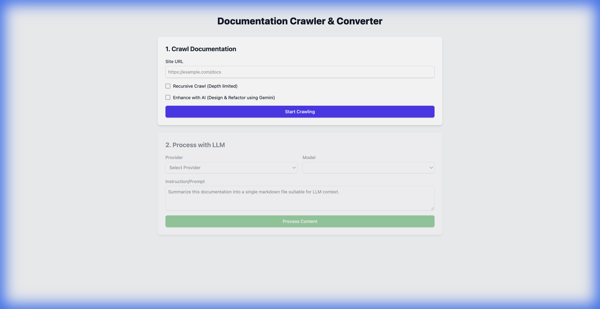

# Antigravity

Antigravity is a documentation crawling and conversion tool designed to extract content from web pages and transform it into LLM-ready formats.



## Features

- **Documentation Crawler**: Crawls web documentation and converts it to Markdown.
- **Recursive Crawling**: Supports depth-limited recursive crawling to capture entire documentation sites.
- **AI Enhancement**: Integrates with Google Gemini to refactor and polish the extracted content for better readability and structure.
- **LLM Processing**: Allows further processing of the content using various LLM providers (Google Gemini, Anthropic Claude, OpenAI).
- **Modern UI**: Clean and responsive user interface built with React and Tailwind CSS.

## Getting Started

### Prerequisites

- Python 3.8+
- Node.js 18+
- API Keys for LLM providers (Google Gemini, Anthropic, OpenAI) set in `.env` or environment variables.

### Installation & Run

We provide a `Makefile` for easy management.

1. **Setup**: Install dependencies for both backend and frontend.
   ```bash
   make setup
   ```

2. **Start**: Run both backend and frontend servers.
   ```bash
   make start
   ```
   - Frontend: http://localhost:5555
   - Backend: http://localhost:5556

3. **Stop**: Stop all running processes.
   ```bash
   make stop
   ```

## Project Structure

```
antigravity/
├── backend/      # FastAPI backend for crawling and LLM processing
├── frontend/     # React + Vite frontend
├── Makefile      # Project management commands
└── ...
```

## Contributing

Contributions are welcome! Please open an issue or submit a pull request for any improvements.

## License

This project is licensed under the MIT License.
